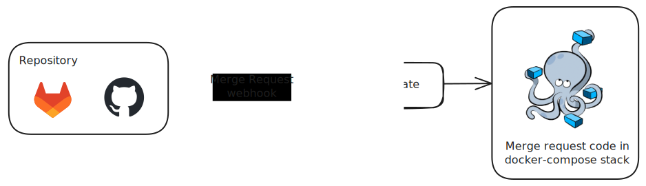
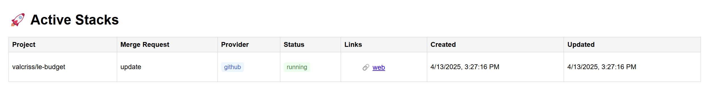

# Instantiate

[](https://valcriss.github.io/Instantiate/) 

## Overview

**Instantiate** automatically provisions full-stack environments for each merge request (MR). By reading simple configuration files committed in your repository, it spins up disposable containers with all your services and exposes them on dynamic ports. It integrates with both GitHub and GitLab through webhooks and works for many technology stacks (Node.js, Java, Python, and more).

### Why Instantiate?

During code review, teams often struggle to reproduce the exact application stack of a branch. Instantiate removes that friction by instantly deploying an isolated environment for every MR. Reviewers can access running services through generated links, test new features in conditions close to production, and provide faster feedback. Once the MR is merged or closed, the environment is automatically destroyed, keeping resources tidy and ensuring reproducible testing.

---

## Key Features

- ✨ **Automatic stack instantiation** on each MR
- 📚 Configuration via `.instantiate/config.yml` and Docker templates
- 🌐 GitHub and GitLab webhook integration
- 📉 Dynamic port allocation with collision prevention
- 🛠️ Live build and runtime logs
- ⚡ Healthcheck and status tracking for deployed services
- ❌ Automatic teardown when MRs are closed
- 🐳 Choose your orchestrator: Compose, Swarm or Kubernetes
- 🚀 Async processing via MQTT queue

---

## How It Works

1. A Merge Request is created in GitHub or GitLab.
2. A webhook sends the event to the Instantiate backend.
3. Instantiate reads the `.instantiate/config.yml` and `.instantiate/docker-compose.yml` templates.
4. A new environment is created using Docker.
5. Dynamic ports are assigned to avoid conflicts.
6. A comment is added to the merge request with Instantiate links 
7. The environment is accessible via `<base-url>:<dynamic-port>` links.
8. When the MR is closed, the stack is automatically destroyed.



---

## Project Structure

- `src/api` – HTTP endpoints (e.g. `/api/update`)
- `src/core` – Core logic: StackManager, PortAllocator, TemplateEngine
- `src/orchestrators` – adapters for Compose, Swarm and Kubernetes
- `src/mqtt` – MQTT publisher and worker (async queueing)
- `tests/` – Unit tests for all core services

---

## Usage

### 1. Configure Your Repository

Instantiate relies on two files stored at the root of your repo under `.instantiate/`.
`config.yml` declares which internal ports should be exposed while `docker-compose.yml`
contains a template of the services to run. Below is a minimal example for a Node frontend
talking to a backend service:

```yaml
# .instantiate/config.yml
orchestrator: compose # compose | swarm | kubernetes
expose_ports:
  - service: front
    port: 3000 # internal port
    name: FRONT_PORT # external port name
  - service: backend
    port: 4200 # internal port
    name: BACKEND_PORT # external port name
```

```yaml
# .instantiate/docker-compose.yml
services:
  front:
    build:
      context: .
      dockerfile: Dockerfile
    environment:
      - BACKEND_URL:{{HOST_DNS}}:{{BACKEND_PORT}}
    ports:
      - '{{FRONT_PORT}}:3000'
  backend:
    image: awesome/backend:latest
    ports:
      - '{{BACKEND_PORT}}:4200'
  database:
    image: postgres:latest
    container_name: database
    restart: unless-stopped
    environment:
      - POSTGRES_USER=username
      - POSTGRES_PASSWORD=password
      - POSTGRES_DB=database
    volumes:
      - db_data:/var/lib/postgresql/data
```

Here is another minimal example for a Python Flask application:

```yaml
# .instantiate/config.yml
orchestrator: compose
expose_ports:
  - service: app
    port: 5000
    name: FLASK_PORT
```

```yaml
# .instantiate/docker-compose.yml
services:
  app:
    build: .
    command: python app.py
    ports:
      - "{{FLASK_PORT}}:5000"
```

### Template variables

When rendering your `docker-compose.yml` template, Instantiate replaces several placeholders:

- `MR_ID` – the merge request identifier.
- `PROJECT_KEY` – the project key associated with the repository.
- `HOST_DNS` – combination of `HOST_SCHEME` and `HOST_DOMAIN` (e.g. `http://localhost`).
- `HOST_DOMAIN` – the domain used to expose containers.
- `HOST_SCHEME` – the URL scheme (`http` or `https`).
- Any variables declared under `expose_ports` in `config.yml` such as `FRONT_PORT`.

### 2. Set Up Instantiate

To run Instantiate locally or on a server, you need to:

1. **Download** the [`docker-compose.yml`](https://raw.githubusercontent.com/valcriss/Instantiate/refs/heads/main/docker-compose.yml) file and place it at the root of your deployment folder.
2. **Set environment variables** in **instantiate** service to configure Instantiate according to your needs (see table below).
3. **Launch the stack** with:

```bash
docker compose up -d
```
#### Environment Variables

| Variable                   | Required                                         | Description                                                                                |
| -------------------------- | ------------------------------------------------ | ------------------------------------------------------------------------------------------ |
| NODE_ENV                   | Yes                                              | Should be set to production to enable production mode behavior.                            |
| LOG_LEVEL                  | Default : info                                   | Logging verbosity (info, warn, debug, error). Default is info.                             |
| HOST_DOMAIN                | Default : localhost                              | Public domain name or IP where Instantiate build stacks are accessible (e.g. localhost).   |
| HOST_SCHEME                | Default : http                                   | URL scheme to use (http or https). Used to build stack URLs.                               |
| PORT_MIN                   | Default : 10000                                  | Lower bound for dynamically allocated ports.                                               |
| PORT_MAX                   | Default : 11000                                  | Upper bound for dynamically allocated ports.                                               |
| REPOSITORY_GITLAB_USERNAME | Required for private repositories                | GitLab username with access to the repositories being deployed (for private repositories). |
| REPOSITORY_GITLAB_TOKEN    | Required for private repositories and comments   | GitLab personal access token for commenting on merge requests.                             |
| REPOSITORY_GITHUB_USERNAME | Required for private repositories                | GitHub username with access to the repositories being deployed (for private repositories). |
| REPOSITORY_GITHUB_TOKEN    | Required for private repositories and comments   | GitHub personal access token for commenting on merge requests                              |
| DATABASE_URL               | Default : localhost db                           | PostgreSQL connection string used by Instantiate                                           |
| MQTT_BROKER_URL            | Default : localhost mqtt                         | Address of the MQTT broker used for asynchronous processing                                |
| IGNORE_SSL_ERRORS          | Default : false                                  | Set to `true` to disable SSL verification for Git operations and HTTP requests             |


### 3. Configure Webhooks

For each repository:
- Go to GitHub or GitLab
- Add a webhook:
  - URL: `http://<your-host>:3000/api/update?key=<project-key>`
  - Event: Merge Request or Pull Request events

---

### 4. Stack Overview Page

Instantiate provides a lightweight, server-rendered web page at /stacks that displays all currently running stacks.

Each stack entry includes:
- The project key and merge request ID
- The source control provider (GitHub or GitLab)
- A list of clickable service URLs
- The creation date and time

This page offers a quick and human-friendly overview of all deployed environments, without requiring a separate frontend or dashboard service.



### 5. Deployment

Instantiate itself is shipped as a Docker Compose stack. Copy the provided
`docker-compose.yml` to your server and create a `.env` file based on
`.env.example`.

```bash
cp .env.example .env
# adjust values such as HOST_DOMAIN and repository credentials
docker compose up -d
```

Running the services behind a reverse proxy (e.g. Traefik) lets you expose both
the API and the ephemeral stacks under your own domain.

#### Example Traefik configuration

To route URLs of the form `{{merge request id}}-{{service name}}.domain.com` to
the right container, declare labels in your stack template and enable the Docker
provider:

```yaml
# .instantiate/docker-compose.yml
services:
  front:
    build: .
    labels:
      - traefik.enable=true
      - "traefik.http.routers.front.rule=Host(`{{MR_ID}}-front.{{HOST_DOMAIN}}`)"
      - "traefik.http.services.front.loadbalancer.server.port=3000"
    ports:
      - "{{FRONT_PORT}}:3000"
  backend:
    image: awesome/backend:latest
    labels:
      - traefik.enable=true
      - "traefik.http.routers.backend.rule=Host(`{{MR_ID}}-backend.{{HOST_DOMAIN}}`)"
      - "traefik.http.services.backend.loadbalancer.server.port=4200"
    ports:
      - "{{BACKEND_PORT}}:4200"
```

Add Traefik to your deployment stack:

```yaml
# docker-compose.override.yml
services:
  traefik:
    image: traefik:v3.0
    command:
      - '--providers.docker=true'
      - '--entrypoints.web.address=:80'
    ports:
      - '80:80'
    volumes:
      - /var/run/docker.sock:/var/run/docker.sock
```

With this configuration, a stack for merge request `42` exposes
`http://42-front.<your-domain>` and `http://42-backend.<your-domain>`.

## Development

```bash
npm run dev            # Starts the api
npm run worker:mqtt    # Starts the mqtt worker
npm run lint           # Lint the code
npm run format         # Format with Prettier
npm run test           # Run tests
npm run test:coverage  # Run tests with coverage
```

## End-to-end testing

You can quickly try Instantiate locally by running both the API and a GitLab
instance with Docker Compose:

```bash
# Start the API and its dependencies
docker compose -f docker-compose.dev.yml up -d

# In another terminal, launch GitLab
docker compose -f docker-compose.gitlab.yml up -d
```

After GitLab is ready, create a test project and add a webhook pointing to
`http://localhost:3000/api/update?key=<project-key>`.
Open a merge request in that repository and then visit `/stacks` to confirm
that the stack for the MR appears.

---

## License

This project is licensed under the [MIT License](LICENSE).

---

## Author

Maintained by [@valcriss](https://github.com/valcriss)

